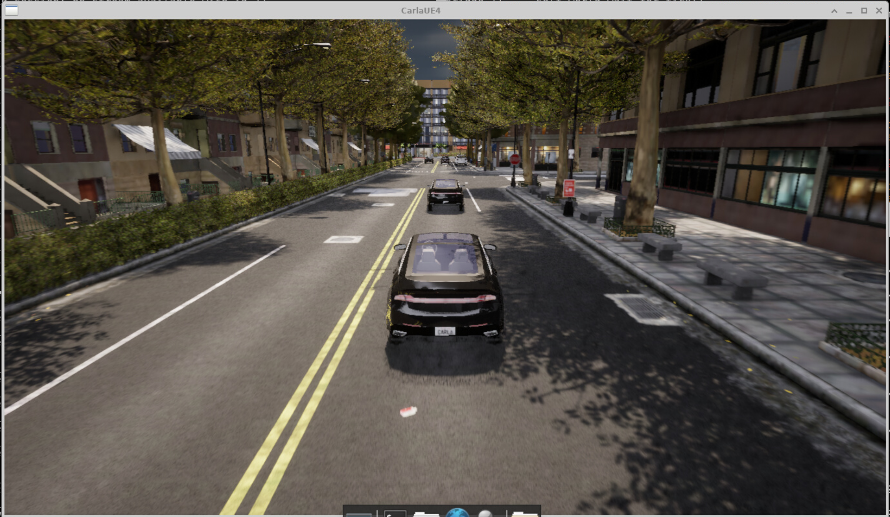

# 自动驾驶仿真环境构建

分阶段搭建基于 CARLA 的自动驾驶仿真学习环境。

目标平台：**Ubuntu 22.04 (jammy)** + NVIDIA GPU。

## 目录结构

运行时数据默认放在 `$HOME/sim-env`：

```text
~/sim-env/
├── miniconda3/          # Miniconda（Stage 0）
├── data/                # 离线包与解压产物
│   ├── carla-0-9-16-linux.tar.gz
│   ├── turbovnc_3.3_amd64.deb
│   ├── Carla-Autoware-Bridge-main.zip
│   ├── CARLA_0.9.16/
│   └── scenario_runner/
└── carla-ros2-ws/       # ROS 2 工作空间（Stage 4）
```

Git 仓库只包含脚本，可 clone 到任意位置；运行时数据写入 `~/sim-env`。

## 快速开始

1. Clone 本仓库。
2. 将离线大文件放入 `~/sim-env/data/`（若尚未运行 Stage 0，需先创建该目录）：
   - `carla-0-9-16-linux.tar.gz`
   - `Carla-Autoware-Bridge-main.zip`
   - `turbovnc_3.3_amd64.deb`
3. 按需修改 `env_config.sh`，或复制 `env_config.local.sh.example` 为 `env_config.local.sh`。
4. 按顺序执行各 Stage：

```bash
bash stage0_miniconda.sh
bash stage0_container_runtime.sh  # Docker + NVIDIA Container Toolkit; no VNC
bash stage1_vnc.sh
bash stage2_python.sh
bash stage3_carla.sh
bash stage4_ros.sh
bash stage5_scene.sh
```

5. 新开终端或执行 `source ~/.bashrc`，使 conda / ROS 环境变量生效。

## 各 Stage 说明

| Stage | 脚本 | 作用 |
|-------|------|------|
| 0 | `stage0_miniconda.sh` | 创建 `~/sim-env`，配置 apt/conda/pip 清华源，安装 Miniconda |
| 1 | `stage1_vnc.sh` | XFCE 桌面 + TurboVNC 远程桌面 |
| 2 | `stage2_python.sh` | 创建 Conda 环境 `autodrive`，安装 Python 依赖 |
| 3 | `stage3_carla.sh` | 解压 CARLA，安装 Python API |
| 4 | `stage4_ros.sh` | ROS 2 Humble + Carla-Autoware-Bridge |
| 5 | `stage5_scene.sh` | ScenarioRunner |

不需要远程桌面时可跳过 Stage 1。

NuRec/容器任务可先运行 `stage0_container_runtime.sh`。该脚本不安装 VNC，
并会用 CUDA 容器验证 GPU 访问；重新登录 SSH 后当前用户可直接运行 Docker。

## 路径配置

所有脚本启动时都会 `source env_config.sh`。也可在运行时覆盖变量：

```bash
ENV_HOME=/data/sim-env bash stage3_carla.sh
```

常用变量：

| 变量 | 默认值 | 说明 |
|------|--------|------|
| `ENV_HOME` | `~/sim-env` | 运行时根目录 |
| `BLOCKDATA_DIR` | `$ENV_HOME/data` | 离线包与解压目录 |
| `CONDA_ROOT` | `$ENV_HOME/miniconda3` | Miniconda 安装路径 |
| `CONDA_ENV_NAME` | `autodrive` | Conda 环境名 |
| `CARLA_VERSION` | `0.9.16` | CARLA 版本 |
| `CARLA_ROOT` | `$BLOCKDATA_DIR/CARLA_0.9.16` | CARLA 解压目录 |
| `CARLA_PORT` | `2000` | CARLA 服务端口 |
| `ROS2_WS` | `$ENV_HOME/carla-ros2-ws` | ROS 2 工作空间 |
| `SCENARIO_RUNNER_ROOT` | `$BLOCKDATA_DIR/scenario_runner` | ScenarioRunner 目录 |
| `PIP_INDEX_URL` | 清华 pip 源 | pip 镜像 |

Stage 0 / 2 / 4 / 5 会向 `~/.bashrc` 写入带 marker 的环境块（conda init、环境激活、ROS 2、CARLA 路径等）。

## 日常使用

```bash
bash start_vnc.sh
bash start_carla.sh
bash verify.sh 3        # CARLA 安装 + 运行时冒烟
bash verify.sh 4        # ROS 2 安装 + DDS 通信冒烟
```

## 验证

```bash
bash verify.sh          # 全量检查（含 Stage 3/4 运行时项）
bash verify.sh 0        # 仅 Stage 0
bash verify.sh 3        # Stage 3（运行时需先 start_carla.sh）
bash verify.sh 4        # Stage 4
```

Stage 3 运行时测试需要 CARLA 服务已启动。若未启动，静态检查仍会执行，运行时项记为 WARN。

---

## 端到端测试（End-to-End）

以下流程将 **CARLA + ROS 2 Bridge + Ego 车辆 + ScenarioRunner + 跟随视角** 串联起来。  
需要 **Stage 0–5 全部完成**，且已 `source ~/.bashrc`。

默认路径（与 `env_config.sh` 一致，若你改过配置请自行替换）：

```bash
ENV_HOME=~/sim-env
CARLA_ROOT=~/sim-env/data/CARLA_0.9.16
SCENARIO_RUNNER_ROOT=~/sim-env/data/scenario_runner
REPO_ROOT=/path/to/carla-ad-sim-setup    # 本仓库 clone 路径
```

### 推荐启动顺序

依赖关系：**CARLA 服务端 → ROS Bridge → 生成 Ego →（可选）跟随视角 / ScenarioRunner**。  
建议开 **5 个终端**，按序启动；前一步就绪后再开下一步。

#### 终端 0（可选）：远程桌面

需要 VNC 看画面时：

```bash
bash start_vnc.sh
# Windows 上用 TurboVNC Viewer 连接 <Pod_IP>:5901
```

#### 终端 1：CARLA 服务端

在仓库目录下：

```bash
bash start_carla.sh
```

等待 CARLA 完全加载（地图就绪、端口 `2000` 监听）。

#### 终端 2：ROS 2 Bridge

```bash
source ~/.bashrc
ros2 launch carla_ros_bridge carla_ros_bridge.launch.py \
    host:=localhost \
    port:=2000 \
    passive:=True \
    synchronous_mode:=True \
    timeout:=30
```

Bridge 连上 CARLA 并保持同步模式后，再进行下一步。

#### 终端 3：生成 Ego 车辆

```bash
source ~/.bashrc
ros2 launch carla_spawn_objects carla_example_ego_vehicle.launch.py
```

成功后场景里应出现 `role_name=hero` 的 ego 车辆（`follow_ego.sh` 依赖此车）。

#### 终端 4（可选）：Spectator 跟随 ego

```bash
cd /path/to/carla-ad-sim-setup
bash tools/follow_ego.sh
```

同步模式下用 `tools/follow_ego.sh`；若 Bridge 未开同步，可改用 `tools/follow_ego_no_sync.sh`。

#### 终端 5：ScenarioRunner 跑路线

```bash
source ~/.bashrc
cd ~/sim-env/data/scenario_runner

python scenario_runner.py \
    --route srunner/data/routes_town10.xml \
    --route-id 0 \
    --agent srunner/autoagents/npc_agent.py \
    --port 2000 \
    --output /tmp/srunner_out
```

`--output` 需指向结果输出目录，按实际需求修改。

### 流程概览

```text
start_vnc.sh (可选)
    ↓
start_carla.sh                    # CARLA :2000
    ↓
carla_ros_bridge.launch.py        # ROS ↔ CARLA，同步模式
    ↓
carla_example_ego_vehicle.launch  # 生成 hero 车辆
    ↓
tools/follow_ego.sh (可选)        # 相机跟随
    ↓
scenario_runner.py                # 路线 + NPC agent
```

### 调试成功效果

端到端流程跑通后，VNC 中应能看到 CARLA 窗口：ego 车辆行驶在城市路线中，Spectator 跟随视角正常（如下图）。



### 常见问题

| 现象 | 可能原因 |
|------|----------|
| Bridge 连不上 CARLA | `start_carla.sh` 未启动或端口不是 2000 |
| `follow_ego.sh` 找不到 hero | Ego launch 未跑完，或 `role_name` 不是 `hero` |
| ScenarioRunner 报错 | 未 `source ~/.bashrc`，或 CARLA / 同步模式未就绪 |
| 命令找不到 | 未执行 Stage 4/5，或 ROS workspace 未编译 |

路径与 launch 包名以本机 `ros2 pkg list | grep carla` 为准；若与文档不一致，以 workspace 内实际包名为准。
